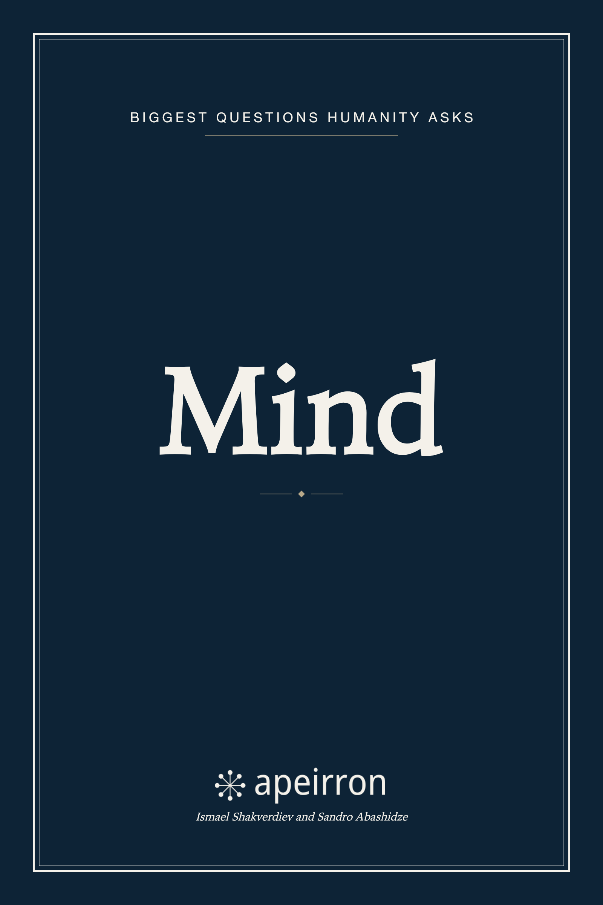
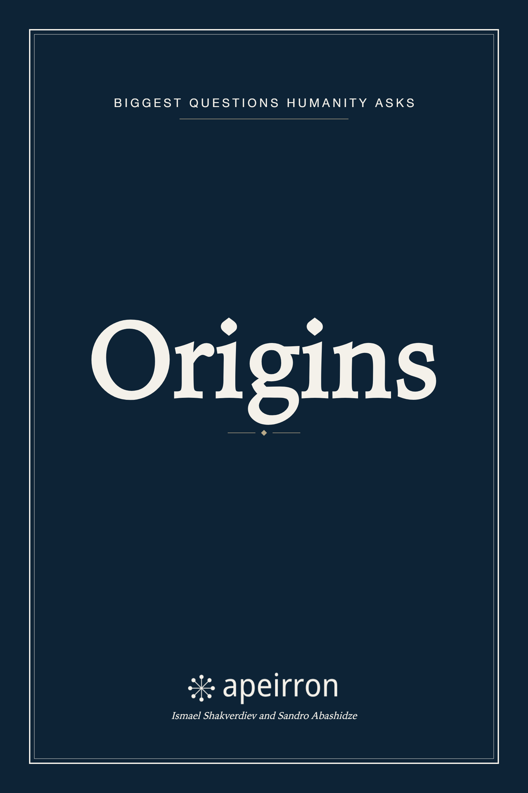
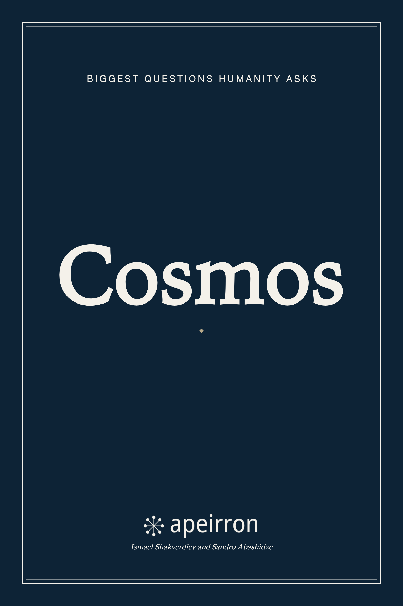
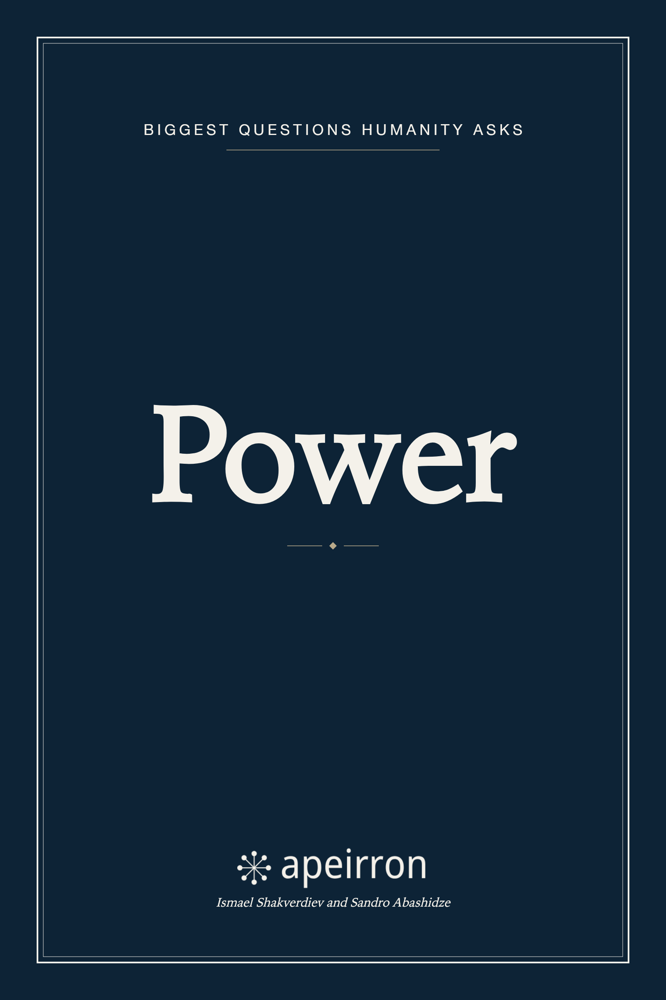
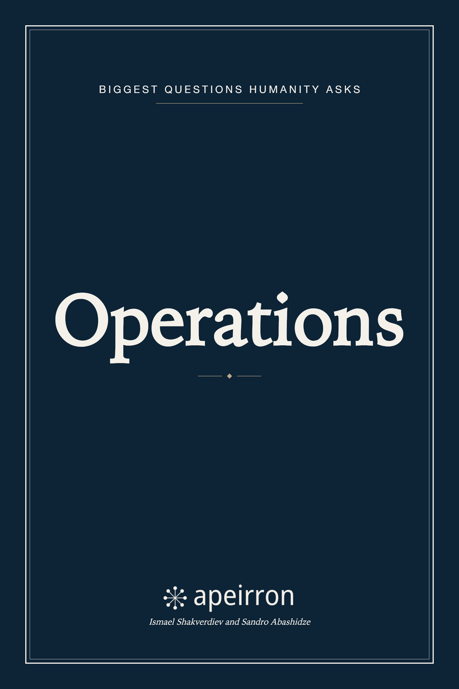
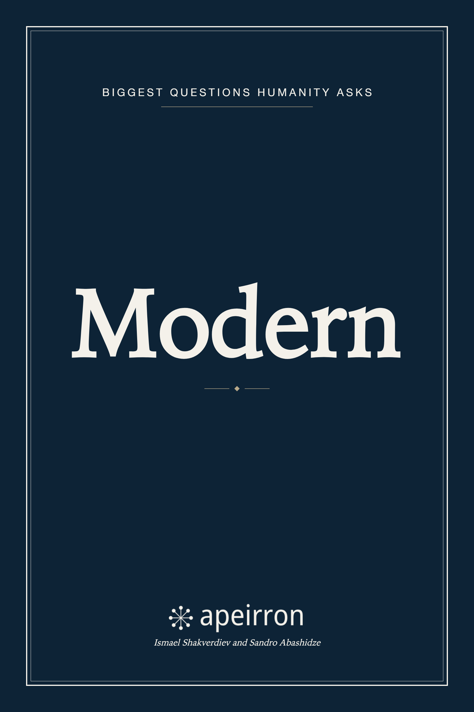
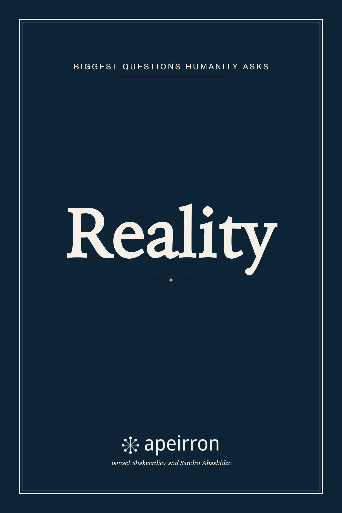

# Apeirron

> *apeiron (ἄπειρον)* — ancient Greek for "the infinite, the boundless, the undefined origin of all things."

An interactive knowledge graph mapping the biggest questions humanity asks — consciousness, ancient civilizations, the nature of reality, hidden power structures, the cosmos and many more — as interconnected nodes in a visual web.

Every idea is a node. Every node links to others. Every connection has a reason. The result is a web of thought where nothing exists in isolation.
## How it works

The site is a force-directed graph. Each node is a topic — written as a narrative deep-dive, not a Wikipedia summary. Click a node to read it. Follow `[[links]]` in the text to fall deeper into the rabbit hole. The graph grows as contributors add new nodes through Pull Requests.

All content lives as Markdown files in the [`content/nodes/`](./content/nodes) directory. The graph, connections, and site are generated automatically from these files at build time. No database, no CMS — just Markdown and Git.

## Books

The same content is also available as a typeset edition: seven EPUB and PDF volumes, one per category, generated from the same nodes. See [`books/`](./books) for the build pipeline and details.

      

## Contributing

Apeirron is open to contributions. You can:

- **Add a new node** — write a deep-dive on a topic and submit a PR
- **Improve an existing node** — better writing, more connections, factual corrections
- **Propose a topic** — open an issue if you have an idea but don't want to write it yourself

Every node must include verifiable sources — books, papers, videos with timestamps, or official documents. PRs without sources will not be merged.

Read the [Contributing Guide](./CONTRIBUTING.md) for details on how to write a node, how connections work, and what makes a good submission.
