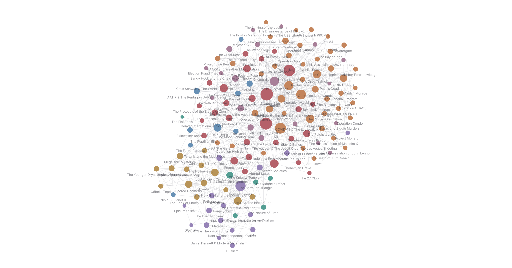
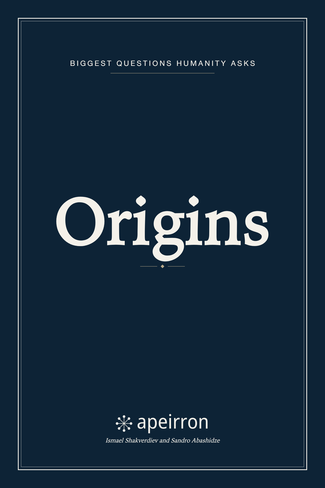
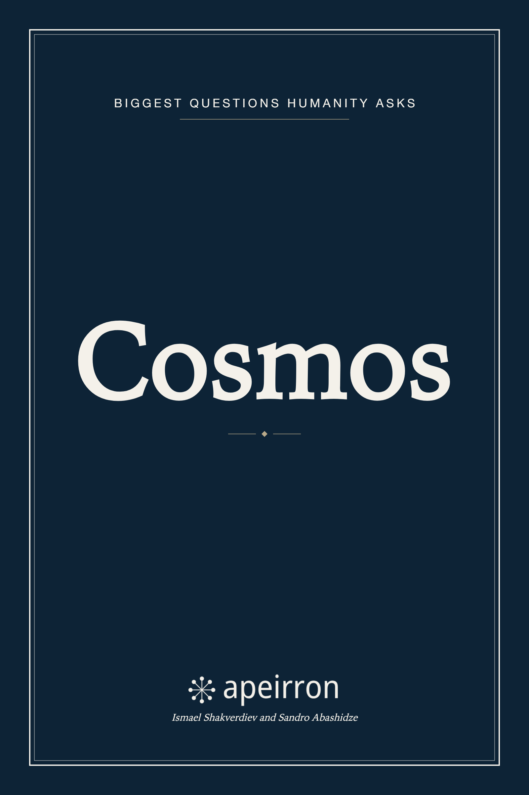
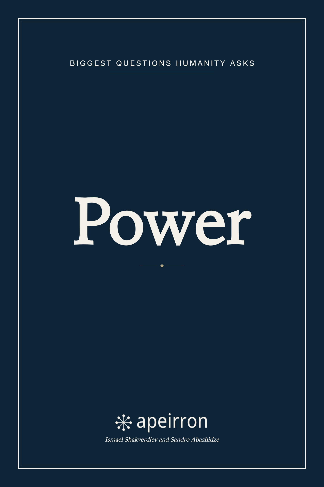
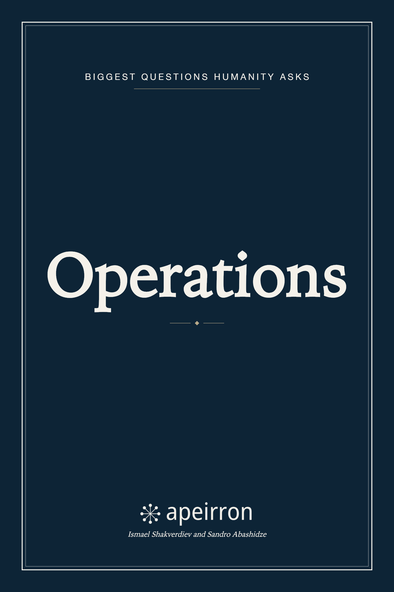
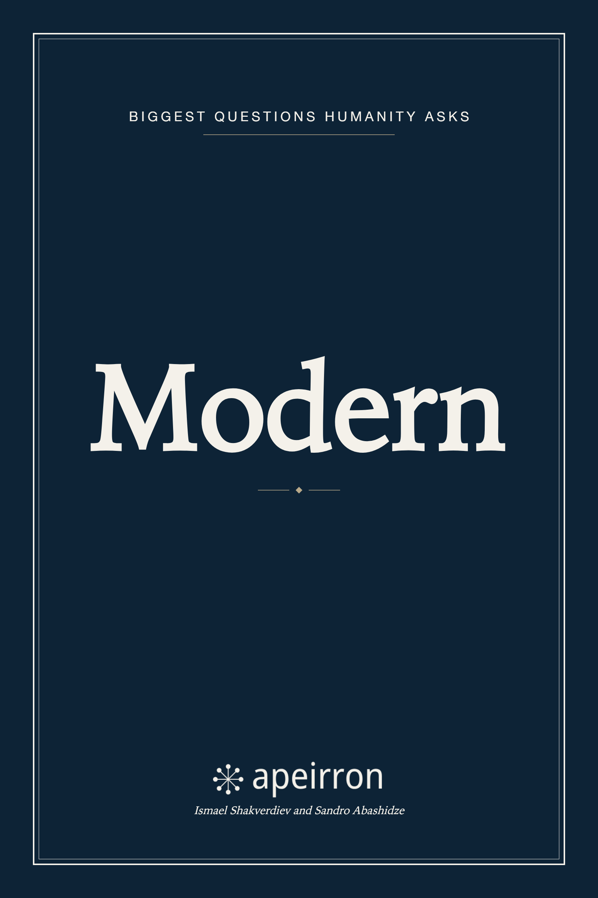
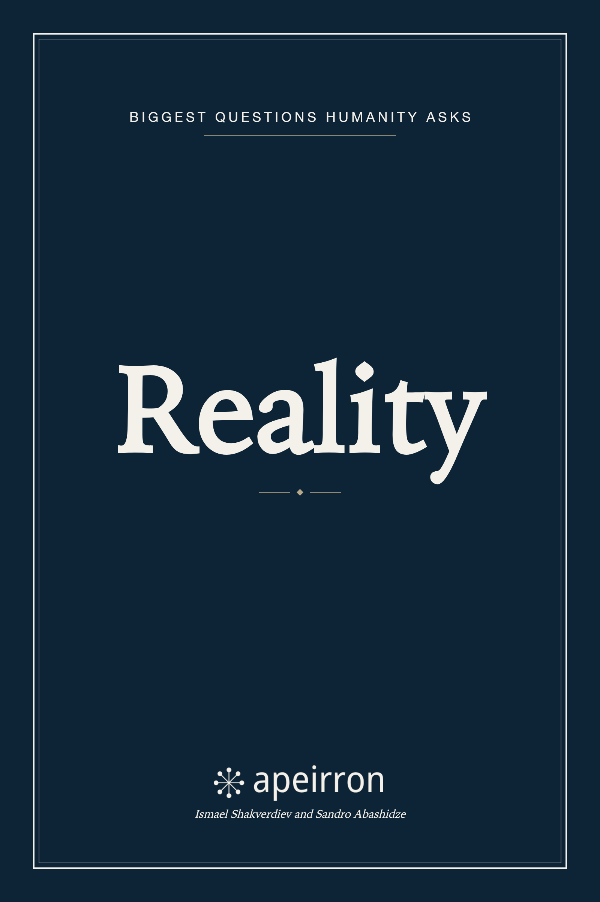

# Apeirron

> *apeiron (ἄπειρον)* — ancient Greek for "the infinite, the boundless, the undefined origin of all things."

An interactive knowledge graph mapping the biggest questions humanity asks — consciousness, ancient civilizations, the nature of reality, hidden power structures, the cosmos and many more — as interconnected nodes in a visual web.



Every idea is a node. Every node links to others. Every connection has a reason. The result is a web of thought where nothing exists in isolation.
## How it works

The site is a force-directed graph. Each node is a topic — written as a narrative deep-dive, not a Wikipedia summary. Click a node to read it. Follow `[[links]]` in the text to fall deeper into the rabbit hole. The graph grows as contributors add new nodes through Pull Requests.

All content lives as Markdown files in the [`content/nodes/`](./content/nodes) directory. The graph, connections, and site are generated automatically from these files at build time. No database, no CMS — just Markdown and Git.

## RSS feed

New nodes are published to an RSS feed at [`/feed.xml`](https://www.apeirron.com/feed.xml), ordered by date added with the newest node on top. Subscribe to follow the graph as it grows.

## Books

The same content is also available as a typeset edition: seven EPUB and PDF volumes, one per category, generated from the same nodes. See [`books/`](./books) for the build pipeline and details.

<a href="books/apeirron-mind.pdf"></a> <a href="books/apeirron-origins.pdf"></a> <a href="books/apeirron-cosmos.pdf"></a> <a href="books/apeirron-power.pdf"></a> <a href="books/apeirron-operations.pdf"></a> <a href="books/apeirron-modern.pdf"></a> <a href="books/apeirron-reality.pdf"></a>


## Audio narration

Every node can be narrated. The [`speech/`](./speech) directory holds a small local text-to-speech pipeline built on [Kokoro-82M](https://huggingface.co/hexgrad/Kokoro-82M) (Apache-2.0): it normalizes a node's Markdown into clean, speakable prose and reads it in a natural voice. Synthesis runs locally on the CPU — no API keys, no cost, and no text ever leaves your machine — and the 82M model generates roughly 12× faster than real-time.

Published narrations are stored as MP3s in a Cloudflare R2 bucket, served from `audio.apeirron.com` — **not** committed to git. A node page shows a **Listen** player automatically once the node's id appears in [`public/audio-manifest.json`](./public/audio-manifest.json); nodes without a published file fall back to the browser's built-in speech synthesis.

### Setup

```bash
cd speech
brew install espeak-ng        # system dependency for pronunciation
uv sync                       # installs Kokoro + the spaCy model (en_core_web_sm)
```

### Generate and publish

```bash
# 1. preview exactly what will be spoken — fast, no synthesis (catches bad text)
uv run python generate.py --check ../content/nodes/consciousness.md

# 2. generate the MP3 locally and listen to it
uv run python generate.py ../content/nodes/consciousness.md consciousness.mp3

# 3. upload it to R2 and add the node to the manifest (needs R2 access — maintainers)
uv run python publish.py consciousness

# 4. commit the manifest + waveform and redeploy so the site shows the player
git add public/audio-manifest.json public/audio-peaks/ && git commit -m "feat(audio): narrate consciousness"
```

Choose a narrator with `--voice` (suggested: `am_michael` (default), `am_puck`, `bm_daniel`, `bm_fable`, `bm_lewis`); run `generate.py --list-voices` to see them all. Anyone can generate and listen locally; only publishing (step 3) needs access to the project's R2 bucket.

**Text normalization.** The cleaner ([`speech/clean.py`](./speech/clean.py)) strips frontmatter, the Sources bibliography, Markdown syntax and footnotes; turns `[[wikilinks]]` into spoken words; and fixes what the TTS model mis-reads (e.g. the Greek gloss in `phi (Φ)`, superscripts, `°C`). It intentionally leaves numbers, years, decades, currency, and initials alone — Kokoro's G2P already handles those — and it preserves paragraph breaks so Kokoro chunks sentences without breaking names at their middle initials.

> **Gotcha — the Hugging Face network check.** On first run the model weights download from Hugging Face and are cached. After that, `huggingface_hub` still pings the Hub each run to check for updates — a metadata check about the public model only, never your content — which surfaces as a `unauthenticated requests to the HF Hub` warning. To skip it and run fully offline once the model is cached, prefix the command with `HF_HUB_OFFLINE=1` (the only catch: offline mode can't fetch a voice you haven't used before).

## Video

Each node can be turned into 3–4 **vertical short-form videos** (YouTube Shorts / Reels / TikTok) — each a self-contained ~40s hook, not a clip of the essay. The [`video/`](./video) directory holds a [Remotion](https://remotion.dev) pipeline that renders each short as a 9:16 film: TikTok-style kinetic captions word-synced to a fresh narration, a montage of engraving-style illustrations that change as each moment is spoken, and an end card. It looks like the site because it reuses the same fonts and paper palette.

Everything runs locally — no API keys. Three offline pieces feed it:

- **A local LLM via [Ollama](https://ollama.com)** writes the punchy scripts (one gripping idea each, grounded in the node) and, per short, picks the drawable moments to illustrate.
- **Word timings** from the [`speech/`](./speech) (Kokoro) pipeline narrate each script and pin every caption and illustration to its exact spoken moment.
- **[FLUX.1-schnell](https://huggingface.co/black-forest-labs/FLUX.1-schnell)** (Apache-2.0, ungated) generates each illustration locally on the Apple-Silicon GPU as an antique engraving, duotoned onto the paper.

### Setup

```bash
cd video
npm install                   # Remotion (downloads a headless Chromium once)
```

Plus two local dependencies for the text and images:

- **Ollama** — install it, start the server, and pull a model: `ollama pull qwen3.5:9b`.
- **FLUX** needs nothing installed up front — `image.py` declares its Python deps inline (PEP&nbsp;723) and `uv` fetches them on first run. The weights (~30&nbsp;GB) download to the Hugging Face cache the first time; comfortable on 32&nbsp;GB+ of unified memory.

### Generate

One command takes a node all the way to finished MP4s in `video/out/`:

```bash
node shorts.mjs fermi-paradox                # authors, narrates, illustrates, renders all 3–4
```

Every stage is **cached** — re-running skips work whose output already exists, so an interrupted run resumes and rerolls are cheap. Per short it runs: script → narration (Kokoro) → image cues (Ollama) → plates (FLUX) → 1620×2880 H.264 render.

### The stages on their own

```bash
node shorts.mjs fermi-paradox --scripts      # just author the scripts, then review them
node shorts.mjs fermi-paradox <slug>         # build one short by slug (full chain)
node shorts.mjs fermi-paradox --render-only  # skip regen, just re-render (after tweaking the composition)
node shorts.mjs fermi-paradox --force        # redo every stage from scratch
uv run image.py "a lone radio telescope" one.png   # a single plate, for testing prompts
```

To reroll a weak illustration, delete its PNG from `video/public/plates/` and re-run — only that one regenerates.

## Contributing

Apeirron is open to contributions. You can:

- **Add a new node** — write a deep-dive on a topic and submit a PR
- **Improve an existing node** — better writing, more connections, factual corrections
- **Propose a topic** — open an issue if you have an idea but don't want to write it yourself

Every node must include verifiable sources — books, papers, videos with timestamps, or official documents. PRs without sources will not be merged.

Read the [Contributing Guide](./CONTRIBUTING.md) for details on how to write a node, how connections work, and what makes a good submission.
